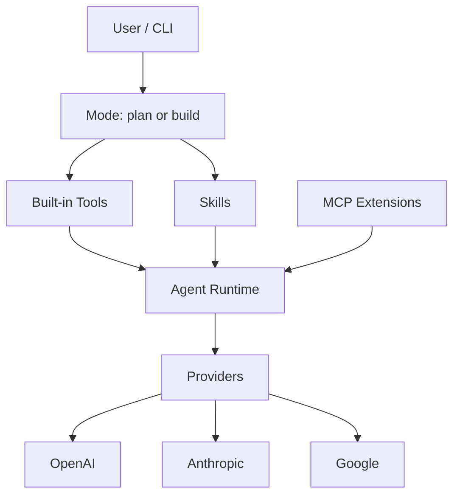
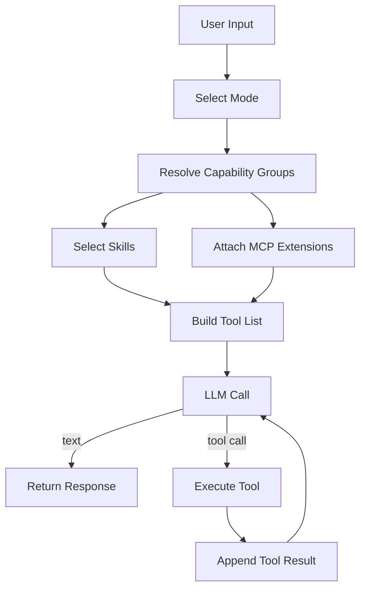

# Architecture

当前产品结构分四层：

1. `mode`
2. built-in tools
3. skills
4. MCP extensions

## Mode

产品入口只有两个：

- `plan`
- `build`

## Built-in Tools

默认 capability groups：

- `read`
  - `read`
  - `search`
  - `ask_user`
- `edit`
  - `write`
  - `run`
- `memory`
  - `memory_get`
  - `memory_put`
  - `memory_search`
  - `memory_list`
- `research`
  - `web_search`
  - `web_fetch`
- `task`
  - `task`

Mode 到 capability groups 的映射：

- `plan`
  - `read`
  - `memory`
  - `research`
  - `task`
- `build`
  - `read`
  - `edit`
  - `memory`
  - `research`
  - `task`

Persona 和 generic memory 分开：

- generic memory
  - `memory_get`
  - `memory_put`
  - `memory_search`
  - `memory_list`
- persona
  - `update_user_persona`
  - `get_user_persona`

persona 不属于默认 `plan/build` built-in tool surface。

## Skills

Skills 是 prompt-layer 结构化指令，不是工具。

当前行为：

- 从 `.agent/skills/*/SKILL.md` 发现
- 按上下文相关性选择
- 按 `mode` 过滤
- 注入 system prompt

当前 metadata：

- `name`
- `description`
- `triggers`
- `priority`
- `requires`
- `files`
- `mode`
- `tools`
- `constraints`

## MCP Extensions

MCP 是扩展能力层。

默认不进 built-in 主链的能力，例如：

- browser
- database
- 外部系统集成

当前 runtime 支持：

- local extension groups
- remote MCP servers

远端 transport：

- `streamable_http`
- `stdio`

当前 runtime 特性：

- fail-open
- retry
- failure cooldown
- `mcp-session-id` 会话复用
- trace source 标记

## Trace

当前 trace 会记录：

- `mode`
- `capability_groups`
- `active_tools`
- `active_skills`
- `active_mcp_extensions`

tool call source：

- `built_in`
- `mcp_extension`
- `mcp_remote`

## Data Flow

